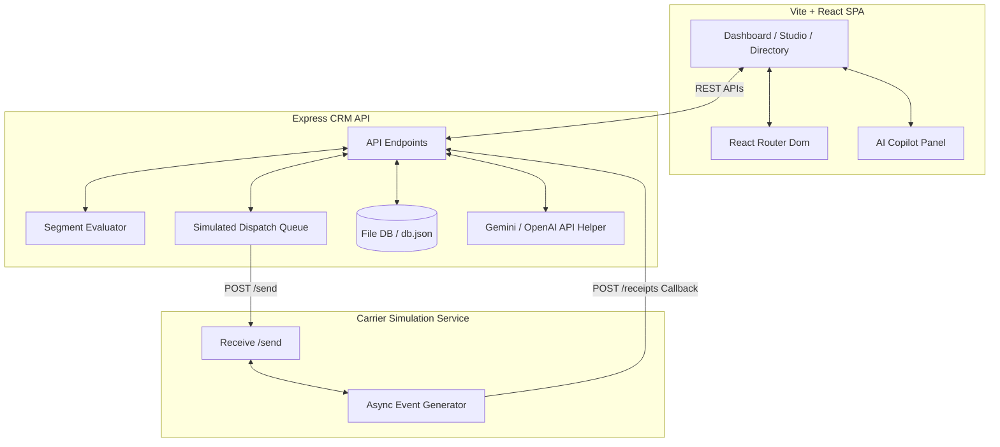

# Xeno Mini CRM - AI-Native Shopper Outreach

Hello! This is my engineering take-home assignment submission for the Xeno SDE/FDE roles. 

I have built an **AI-Native Mini CRM** that helps direct-to-consumer (DTC) and retail brands intelligently segment customer demographics, write personalized omni-channel campaigns using AI assistance, trace carrier dispatches via a rate-limited queue, and handle asynchronous interaction callback events in real-time.

---

## 🏗️ Architecture & Component Design

The platform is designed as a modular, decoupled stack consisting of three services:



1. **CRM Frontend (Port 5173)**: Built using React, Vite, and Tailwind CSS. The app features tabbed sub-routes managed by `react-router-dom` to display an Analytics Dashboard, Shoppers Directory (with CSV uploading), Campaigns Studio, Segment Query Builders, and System Queue Logs.
2. **CRM Backend (Port 3001)**: An Express API that manages customer records, processes campaign launches, runs segment calculations, and ingests carrier callback receipts.
3. **Simulated Channel Service (Port 4001)**: A stubbed messaging service that mimics carrier delivery pipelines. It accepts campaign batches and asynchronously posts delivery tracking updates (queued ➔ sending ➔ delivered/failed ➔ opened ➔ clicked ➔ order attributed) back to the CRM receipt webhook.

---

## 🧠 AI-Native Features (Xeno Copilot)

Instead of stitching on a simple text-generation box, AI is deeply woven into the operations of the CRM:

*   **Interactive Copilot Agent**: A sliding chat panel where you can talk to "Xeno Copilot". Grounded with live database counts (customers, orders, active campaigns, pre-saved segments), it can answer analytical questions or draft campaigns.
*   **One-Click "Confirm & Execute" Action Cards**: When you ask the Copilot to perform database operations (e.g., *"Make a segment for people who spent more than $150"*), the AI outputs structured tool commands. The chat renders an approval card allowing you to create the segment or draft the campaign directly with a single click.
*   **AI Segment Compiler**: Translate raw natural language prompts (e.g. *"dormant shoppers who haven't ordered in 60 days"*) into structured query logic trees (using conditions like `last_order_days > 60`) that compile instantly.
*   **Channel copywriting**: Draft message templates targeting specific customer traits (names, LTV) with automated copy constraint limits (concise for SMS/RCS, rich templates for Email).

---

## ⚡ Asynchronous Queue & System Design Tradeoffs

In a production scenario, launching a campaign to 100,000 customers cannot be executed as a single blocking loop. To address this, I made the following system choices:

1. **Controlled Queue Dispatcher**: Campaigns are loaded into an in-memory queue array. A queue worker pops and delivers messages in rate-limited batches (5 messages per second). This prevents the CRM from flooding external carrier APIs and failing under peak load.
2. **Re-routing Retries**: The retry endpoint for failed deliveries does not execute direct calls. Instead, it re-queues the message back into the rate-limited background worker pipeline, keeping traffic distribution predictable.
3. **Memory Evaluation**: Segment evaluation runs dynamically in memory using a recursive condition tree. For a startup database (<50k records), this provides instantaneous rule previews. *At scale, I would compile these logical filters into index-optimized SQL queries executed directly inside PostgreSQL.*

---

## 🚀 Quick Start & Setup

### 1. Environment & API Keys
Create a `.env` file in the `crm-backend/` directory:
```bash
# Set your API Key (Gemini is recommended, OpenAI is fully supported)
GEMINI_API_KEY=AIzaSy...
# OR
OPENAI_API_KEY=sk-proj-...
```

### 2. Install & Start
Run the following commands from the root directory:
```powershell
# Install all dependencies
npm install

# Start CRM Backend, Channel Stub, and Frontend concurrently
npm run dev
```
Open `http://localhost:5173` to access the CRM dashboard. Use the **Settings** page to clear and seed the database with mock VIP shoppers, then toggle the **Xeno Copilot** in the header to test the AI sandbox!

---

## 🧪 Verification & Smoke Testing
Run the automated smoke test script to verify endpoint integrations, queue creation, and callback attribution loops:
```bash
npm run test
```
The test will automatically spin up a campaign, dispatch messages, wait for simulated carrier timeouts, and print the resulting analytics history.
